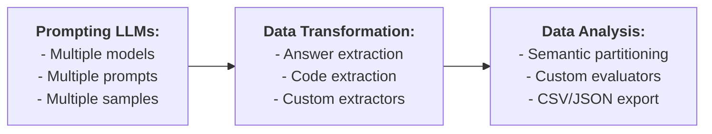

# llm-play

llm-play is a tool that queries LLMs, analyzes responses, and executes experimental pipelines.

## Installation

Set some of the following API keys as environment variables, depending on the services you plan to use:

- `DASHSCOPE_API_KEY`
- `DEEPSEEK_API_KEY`
- `CLOSEAI_API_KEY`

Install the tool by running the command `python -m pip install .`

## Basic Usage

An LLM can be queried via an argument, a specified prompt file, or stdin:

    llm-play "What is the capital of China?"
    llm-play --prompt prompt.md
    llm-play < prompt.md

The argument and the file options are mutually-exclusive. They both take precedence over stdin.

In either of these options, the response is printed on stdout, and can be redirected to a file:

    llm-play "What is the capital of China?" > output.md

For convenience, default settings such as the model and its temperature can be configured interactively with `-c/--configure`. These settings are saved in `~/.llm_play.yaml`:

    llm-play -c

Command-line options take precedence over the default settings.

## Batch Processing

When either the number of models or prompts or responses is greater than one, the tool operates in batch mode. For example, to sample 10 responses from two models (`qwen2.5-7b-instruct` and `qwen2.5-coder-7b-instruct`) with a temperature of 0.5, use the command:

    llm-play --prompt prompts/question1.md \
             --model qwen2.5-72b-instruct qwen2.5-7b-instruct \
             -t 0.5 \
             -n 10

In batch mode, a short summary of responses will be printed on stdout:

    Model                │ Temp. │ Label     │ Hash       │ Sample │ Class │ Content
    ─────────────────────┼───────┼───────────┼────────────┼────────┼───────┼────────
    qwen2.5-72b-instruct │   0.5 │ question1 │ 4ae91f5... │      0 │     0 │ "It ...
    qwen2.5-72b-instruct │   0.5 │ question1 │ 4ae91f5... │      1 │     1 │ "It ...
    qwen2.5-72b-instruct │   0.5 │ question1 │ 4ae91f5... │      2 │     2 │ "It ...
    qwen2.5-72b-instruct │   0.5 │ question1 │ 4ae91f5... │      3 │     3 │ "It ...
    qwen2.5-72b-instruct │   0.5 │ question1 │ 4ae91f5... │      4 │     4 │ "It ...
    qwen2.5-72b-instruct │   0.5 │ question1 │ 4ae91f5... │      5 │     5 │ "It ...
    ...

In this table, `question1` is the prompt label, `4ae91f5bd6090fb6` is its SHAKE128 length=8 hash. Prompts with repeating hashes are skipped.  The `Class` column displays the IDs of equivalence classes of responses. Please see [Partitioning](#partitioning) for details.

To save full results, the output store needs to be specified with the option `--output`. For example, adding `--output samples` will save the results in the following filesystem tree:

    samples
    ├── qwen2.5-7b-instruct_0.5
    │   ├── question1_4ae91f5bd6090fb6.md
    │   └── question1_4ae91f5bd6090fb6
    │       ├── 0_0.md
    │       ...
    │       └── 9_9.md
    └── qwen2.5-coder-7b-instruct_0.5
        ├── question1_4ae91f5bd6090fb6.md
        └── question1_4ae91f5bd6090fb6
            ├── 0_0.md
            ...
            └── 9_9.md

In this tree, `question1_4ae91f5bd6090fb6.md` contains the prompt; `0_0.md`, ..., `9_9.md` are the samples. In `5_3.md`, `5` is the sample identifier, and `3` is the identifier of its equivalence class.

The data can also be stored in CSV and JSON formats. Please see [Data Formats](#data-formats) for details.

Multiple prompt files can be specified as inputs, e.g. using all `*.md` files in the current directory:

    llm-play --prompt *.md --output samples

[WIP] When the argument of `--prompt` is a directory, all `*.md` files are loaded from this directory non-recursively.

If the query originates from a file, the prompt will adopt the file's name (excluding the extension) as its label. When a query is supplied through stdin or as a command-line argument, the label is empty.

[WIP] To update an existing store, the `--update` option should be used instead of `--output`:

    llm-play --prompt *.md --update samples

In case of collisions, i.e. samples for the same (model, temperature, prompt) tuple already exist in the store, the prompt labels with matching hashes will be updated, and the old responses are removed.

## Data Transformation

Data transformation can be used, for example, to extract relevant information from the generated samples or from data extracted in earlier stages. This is to extract text within the tag `<answer> ... </answer>` from all samples in `samples`, and save the results into the directory `extracted`:

    llm-play --map samples \
             --function __FIRST_TAGGED_ANSWER__ \
             --output extracted

The above function searches for text wrapped within `<answer>` and `</answer>` tags and prints only the content inside the tags.

[WIP] By default, the extracted data is saved into "txt" files. The file extension can be specified using the `--extension` options, e.g. `--extension py` resulting in:

    extracted
    └── qwen2.5-7b-instruct_1.0
        ├── _4ae91f5bd6090fb6.md
        └── _4ae91f5bd6090fb6
            ├── 0_0.py
            ├── 1_1.py
            ...
            └── 9_9.py

### Functions

Transformation is performed by either builtin functions or shell commands. The builtin function `__ID__` simply returns the entire string without modification. The builtin function `__FIRST_TAGGED_ANSWER__` returns the first occurence of a string wrapped into the tag `<answer></answer>`. The builtin function `__FIRST_MARKDOWN_CODE_BLOCK__` extract the content of the first markdown block.

Function defined through shell commands should use the [shell template language](#shell-template-language). For example, this is to count the number of characters in each sample:

    --function 'wc -m < %%ESCAPED_DATA_FILE%%'

A transformation of a datum fails iff the function terminates with a non-zero exit code; in this case, the datum is ignored. Thus, shell commands can also be used for data filtering. e.g. filtering out responses not containing useful information.

Answers can also be extracted by LLMs. For example, this function checks if a prevously received response is affirmative:

    --function "llm-play '<answer>'%%CONDENSED_ESCAPED_DATA%%'</answer>. Is this answer affirmative? Respond Yes or No.' --model qwen2.5-7b-instruct --answer"

### On-the-fly Transformation

Data can be extracted on-the-fly while querying LLMs if `--function` is explicitly provided:

    llm-play "Name a city in China. Your answer should be formatted like **CITY NAME**" \
             --function "grep -o '\*\*[^*]*\*\*' %%ESCAPED_DATA_FILE%% | head -n 1 | sed 's/\*\*//g'"

There are convenience options to simplify extracting answers or code. The option `--answer` automatically augment the prompt and apply the necessary transformation to extract the relevant parts of the response:

    llm-play "${QUESTION}" --answer

is equivalent to

    llm-play "${QUESTION} Wrap the final answer with <answer></answer>."" --function __FIRST_TAGGED_ANSWER__

The option `--code` extracts a code block from Markdown formatting.

    llm-play "Write a Python function that computes the n-th Catalan number" --code

is equivalent to

    llm-play "Write a Python function that computes the n-th Catalan number" --function __FIRST_MARKDOWN_CODE_BLOCK__

In the on-the-fly mode, the transformation options selected with `-c` are ignored.

## Partitioning [WIP]

Responses can be grouped into equivalence classes based on a specified binary relation using the command `--partition`. The equivalence relation used for partitioning can be customized via the `--relation` option. An equivalence is defined via a builtin function or a shell command. The builtin relation `__ID__` checks if two answers are syntactically identical. The builtin relation `__TRIMMED_CASE_INSENSITIVE__` weakens the criteria by ignoring trailing whitespaces and is not case sensitive. A relation defined via a shell command holds iff the command exits with the zero status code. For example, this is to group answers into equivalence classes based on a judgement from the `qwen2.5-7b-instruct` model:

    --relation "llm-play 'Are these two answers equivalent: <answer1>'%%CONDENSED_ESCAPED_DATA1%%'</answer1> and <naswer2>'%%CONDENSED_ESCAPED_DATA2%%'</answer2>?' --model qwen2.5-7b-instruct --predicate"

When performing partitioning, the `--partitioning-mode` needs to be specified:

- `local-merge` computes the transtitive closure of the union of the specified relation and existing relation across responses associated with the same (model, prompt) pair.
- `global-merge` is the same as `local-merge`, but across all responses.
- `local-intersection` computes the intersection of the specified relation and existing relation across responses associated with the same (model, prompt) pair.
- `global-intersection` is the same as `local-intersection`, but across all responses.
- `local-override` uses only the specified relation, ignoring the original one, across responses associated with the same (model, prompt) pair.
- `global-override` is the same as `local-override`, but across all responses.

For instance, to group responses locally without regard to trailing whitespace or differences in letter case, the following command can be used:

    llm-play --partition responses \
             --partitioning-mode local-merge \
             --relation __TRIMMED_CASE_INSENSITIVE__ \
             --output classes

When performing global partitioning of locally partitioned data, the option `--partitioning-mode global-override` must be used to obtain consistent equivalent classes.

Additionally, the option `-c` can be used to select a predefined relation and partitioning settings when using the option `--partition`.

Partitioning is performed on-the-fly during LLM sampling and data transformation. The following options are used by default (the options selected with `-c` is ignored):

    --relation __ID__ --partitioning-mode global-merge

## Predicates [WIP]

Predicates are special one-the-fly boolean response evaluators. For example, this command acts as a predicate over `$CITY`:

    llm-play "Is $CITY the capital of China?" --predicate

It is equivalent to the following:

    if [ "$(llm-play "Is $CITY the capital of China? Respond Yes or No." --answer)" = "Yes" ]; then
        exit 0
    else
        exit 1
    fi

The predicate will terminate with the zero exit code iff it passes the evaluation; its output cannot be exported with `--output`. Predicates can only be applied to commands with a single model/prompt/response.

## Data Formats [WIP]

The supported data formats are

- Filesystem tree (FS-tree) designed for human readability
- JSON files designed for easy storage and sharing
- CSV files for evaluation

The argument of `--output` is treated as a directory path unless it ends with `.json` or `.csv`.

FS-tree and JSON formats are interchangeble. They both can be used as outputs of LLM sampling, and as inputs or outputs of the `--map` and `--partition` commands. Only FS-tree and JSON can be updated with `--update`.

FS-tree enables running commands for a subset of data, e.g.

    llm-play --partition data/qwen2.5-7b-instruct_1.0/a_4ae91f5bd6090fb6 \
             --partitioning-mode local-merge \
             --relation "$EQUIVALENCE" \
             --output classes

The CSV encoding is lossy: the data cannot be loaded back from a CSV file, as it does not save prompts, and truncate long data. If at least one datum is truncated, the corresponding column name is changed from `Content` to `Content [Truncated]`.

To convert between different formats, a transfomtion with an identity function can used:

    llm-play --map data --function __ID__ --relation __ID__ --output data.json

## Shell Template Language

The shell template language allows dynamic substitution of specific placeholders with runtime values before executing a shell command. These placeholders are instantiated and replaced with their corresponding values before the command is executed by the system shell.

Available placeholders for data:

- `%%CONDENSED_ESCAPED_DATA%%` - the single-lined, stripped, truncated and shell-escaped text.
- `%%ESCAPED_DATA%%` - the shell-escaped text.
- `%%CONDENSED_DATA%%` - the single-lined, stripped, truncated text.
- `%%RAW_DATA%%` - the original text.

Similarly, `RAW_`, `ESCAPED_`, `CONDENCED_` and `CONDENSED_ESCAPED_` variants are provided for the following variables:

- `%%PROMPT%%` - the prompt content.

The `ESCAPED_` variants are provided for the following variables:

- `%%DATA_FILE%%` - a path to a temporary file containing the data.
- `%%PROMPT_FILE%%` - a path to a temporary file containing the prompt.
- `%%PROMPT_LABEL%%` - the prompt label.

For equivalence relation commands, which require multiple arguments, the data and prompt placeholders are indexed, e.g. `%%RAW_DATA1%%` and `%%PROMPT_LABEL2%%`.

## Other Options

[WIP] The option `--debug` prints detailed logs on stderr.

The option `--version` prints the version and exits.

The option `--help` prints help message and exits.
