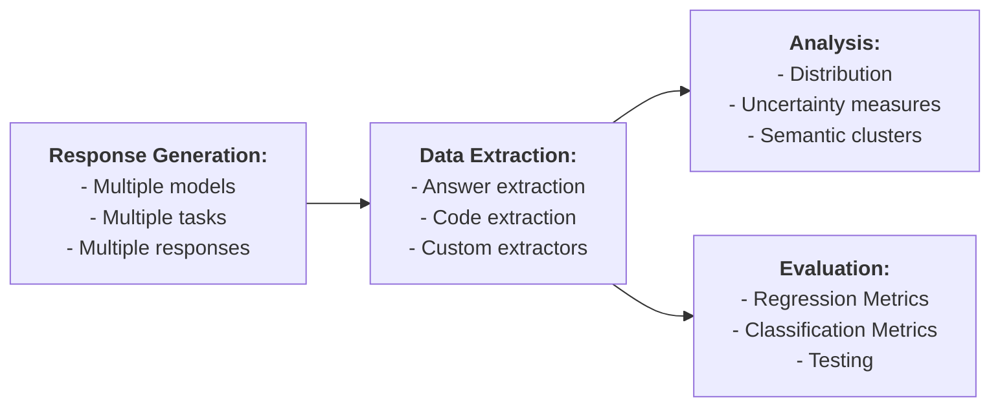

# llm-query

An utility for small-scale experimentation with LLMs in UNIX. It supports the following workflow:

## Installation

Set one or more of the following API keys as environment variables, depending on the services you plan to use:

- `DASHSCOPE_API_KEY`
- `DEEPSEEK_API_KEY`
- `CLOSEAI_API_KEY`

Install the tool by running the command `python -m pip install .`

## Basic Usage

Run the following command to ask a question directly:

    llm-query "What is the capital of China?"

You can input a query stored in a file, such as `prompt.md`:

    llm-query < prompt.md

Write the response to a file (e.g., `output.md`):

    llm-query "What is the capital of China?" > output.md

Set default model, temperature, and other options. These settings are saved in `~/.llm_query.yaml`:

    llm-query -s

Command-line options take precedence over the default settings.

## Batch Processing

To query two models (`qwen2.5-7b-instruct` and `qwen2.5-coder-7b-instruct`) with a temperature of 0.5, generate 10 responses, and save the results into the directory `output`, use the command:

    llm-query "What is the capital of China?" -m qwen2.5-7b-instruct qwen2.5-coder-7b-instruct -t 0.5 -n 10 -o output

The responses will be organized as follows:

    output
    ├── qwen2.5-7b-instruct_1.0
    │   └── __unnamed__
    │       ├── 0.md
    │       ...
    │       └── 9.md
    └── qwen2.5-coder-7b-instruct_1.0
        └── __unnamed__
            ├── 0.md
            ...
            └── 9.md

To query a model with prompts contained in the files `a.md` and `b.md` (or any files matching `*.md` in the current directory), and save the responses into the directory `output`, use the command:

    llm-query -i *.md -o output

When a query is supplied through stdin or as a command-line argument, the task is automatically assigned the identifier `__unnamed__`. However, if the query originates from a file, the task will adopt the file's name (excluding the extension) as its identifier. In cases where multiple files are provided, ensure that their names are unique to avoid conflicts.

An output directory must be explicitly provided (e.g. `-o output`) when querying multiple models/responses/input files.

## Extracting Answers

Extractors are shell commands used to extract specific answers from responses. These commands are defined using a shell template language (described below). The special extractor `ID` simply returns the entire response without modification.

Suppose the following extractor is selected using the `-s` option:

    sed -n '0,/<\/answer>/s/.*<answer>\(.*\)<\/answer>.*/\1/p' %%ESCAPED_OUTPUT_FILE%%

This extractor searches for text wrapped within `<answer>` and `</answer>` tags and prints only the content inside the tags.

The following command will print only the name of the city (i.e., `Beijing`):

    llm-query "What is the capital of China? Wrap the final answer with <answer> </answer>"

You can provide your own custom extractor via the `--extractor` option. A response is treated as not containing any answer iff these two condition hold: (1) the extractor terminates with a non-zero exit code, and (2) its stdout is empty. In this case, the response is ignored.

There are built-in helper functions to simplify extracting answers or code. These helpers automatically augment the prompt and extract the relevant parts of the response.

    llm-query "What is the capital of China?" -a
    llm-query "Write a Python function f(n: int) -> int that computes the n-th Catalan number" -c

## Examining Answers

To analyze the distribution of responses (across one or more models and/or inputs), use the following command:

    llm-query -d output/

A distribution can be computed for a subset of responses:

    llm-query -d output/a.md/qwen2.5-7b-instruct_1.0

To compute the distribution, answers are grouped into equivalence classes. This equivalence is defined via a shell command that exits with a zero status code when two answers are equivalent. The equivalence relation can be configured:

- Using the `-s` option to select a predefined equivalence command.
- Or, specifying a custom equivalence command using the `--equivalence` option.

## Evaluating Results

The evaluation mode is enabled with the `-e` option and evaluates previously computed responses against specified criteria.

To evaluate the responses stored in the output directory by checking if they are equal to `Beijing`, and print an evaluation table, use:

    llm-query -e output --equal Beijing

Evalation can be done for a subset of responses:

    llm-query -e output/a.md/qwen2.5-7b-instruct_1.0 --equal Beijing

When a single response is queried from an single model, it can be evaluated on-the-fly. If the response matches the evaluation criteria, the command will terminate with a zero exit code.

    llm-query "What is the capital of China?" -a --equal Beijing

The evaluator `--equal VALUE` checks if the answer is equivalent to `VALUE` wrt the equivalence relations specified with `--equivalence` or the default one selected with `-s`.

### Custom Evaluator

Instead of comparing responses to a value with `--equal`, you can specify a custom evaluator using the `--evaluator` option. A custom evaluator is a shell command that terminates with a zero exit code if the response passes evaluation.

    llm-query -e output --evaluator 'wc -w <<< %%ESCAPED_OUTPUT%% | grep -q ^1$'

This example evaluates whether each response contains exactly one word.

### Predicates

This helper function acts as a predicate over `$CITY`:

    llm-query "Is $CITY the capital of China?" -p

It is equivalent to the following:

    llm-query "Is $CITY the capital of China? Respond Yes or No." -a --equal Yes >/dev/null

## Shell Template Language

The shell template language allows dynamic substitution of specific placeholders with runtime values before executing a shell command. These placeholders are instantiated and replaced with their corresponding values before the command is executed by the system shell.

Available placeholders:

- `%%OUTPUT%%` - replaced with the raw output.
- `%%OUTPUT_FILE%%` - replaced with a path to a temporary file containing the output.
- `%%INPUT%%` - replaced with the raw input.
- `%%INPUT_FILE%%` - replaced with a path to a temporary file containing the input.
- `%%TASK_ID%%` - replaced with the task id.

For commands that require multiple outputs, indexed placeholders are provided, e.g. `%%OUTPUT1%%`, `%%OUTPUT2%%`.

Variants of shell-escaped placeholders are available for safety when handling special characters, e.g. `%%ESCAPED_OUTPUT%%`.
