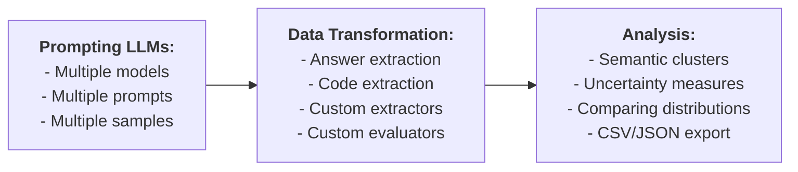

# llm-play

A tool that queries LLMs and executes experimental pipelines.

## Installation

Set some of the following API keys as environment variables, depending on the services you plan to use:

- `DASHSCOPE_API_KEY`
- `DEEPSEEK_API_KEY`
- `CLOSEAI_API_KEY`

Install the tool by running the command `python -m pip install .`

## Basic Usage

Run the following command to ask a question directly:

    llm-play "What is the capital of China?"

You can input a query stored in a file, such as `prompt.md`:

    llm-play < prompt.md
    
or

    llm-play --prompt prompt.md

Write the response to a file (e.g., `output.md`):

    llm-play "What is the capital of China?" > output.md

For convenience, default settings such as the model and its temperature can be configured globally using the option `-c/--configure`. These settings are saved in `~/.llm_play.yaml`:

    llm-play -c

Command-line options take precedence over the default settings.

## Batch Processing

To query two models (`qwen2.5-7b-instruct` and `qwen2.5-coder-7b-instruct`) with a temperature of 0.5, sample 10 responses, and save the results into the directory `samples`, use the command:

    llm-play "What is the capital of China?" \
             --model qwen2.5-7b-instruct qwen2.5-coder-7b-instruct \
             --temperature 0.5 \
             -n 10 \
             --output samples
             
Three store types are supported: `filesystem tree`, `json` and `csv`. In above case, the samples will be stored in a filesystem tree as follows (`__unnamed__` is the prompt id, `__unnamed__.md` contains the prompt, `0.md`, ..., `9.md` are the samples):

    samples
    ├── qwen2.5-7b-instruct_1.0
    │   ├── __unnamed__.md
    │   └── __unnamed__
    │       ├── 0.md
    │       ...
    │       └── 9.md
    └── qwen2.5-coder-7b-instruct_1.0
        ├── __unnamed__.md
        └── __unnamed__
            ├── 0.md
            ...
            └── 9.md
            
Other formats can be enabled by providing a path that ends with the corresponding extensions: `.json` or `.csv`. For example, specifying `--output samples.csv` will export the samples in CSV format. Note that the CSV encoding is lossy: the data cannot be loaded back from a CSV file, as it does not save prompts, and truncate data longer than 30 characters. If at least one datum is truncated, the column name is changed from `Content` to `Content [Truncated]`. The JSON encoding is equivalent to the filesystem encoding, and can be loaded back for further analysis.

To query a model with prompts contained in all files matching `*.md` in the current directory, use the command:

    llm-play --prompt *.md --output samples
    
When a query is supplied through stdin or as a command-line argument, the prompt is automatically assigned the identifier `__unnamed__`. However, if the query originates from a file, the prompt will adopt the file's name (excluding the extension) as its identifier. In cases where multiple files are provided, ensure that their names are unique to avoid conflicts.
    
To update an existing store, the `--update` option should be used instead of `--output`:
    
    llm-play --prompt *.md --update samples

In case of collisions, i.e. samples for the same (model, temperature, prompt) tuple already exist in the store, the matching prompt files will be updated, and the old responses are removed. When updating an existing store, maitain the following invariant: unique prompt identifiers correspond to unique prompts across the entire store.

## Data Transformation

Data transformation can be used, for example, to extract relevant information from the generated samples or from data extracted in earlier stages. Transformation is performed by shell commands defined using a shell template language (described below). The special transformer `__ID__` simply returns the entire string without modification.

This is to extract text within the tag `<answer> ... </answer>` from all samples in `samples`, and save the results into the directory `extracted`:

    llm-play --map samples \
             --output extracted \
             --transformer "sed -n '0,/<\/answer>/s/.*<answer>\(.*\)<\/answer>.*/\1/p' %%ESCAPED_DATA_FILE%%"

The above transformer searches for text wrapped within `<answer>` and `</answer>` tags and prints only the content inside the tags.

A transformation of a datum fails, e.g. if it does not contain any relevant information to extract, iff the following two conditions hold: (1) the transformer terminates with a non-zero exit code, and (2) its stdout is empty. In this case, the datum is ignored.

By default, the extracted data is saved into "txt" files. The file extension can be specified using the `--extension` options, e.g. `--extension py` resulting in:

    extracted
    └── qwen2.5-7b-instruct_1.0
        ├── __unnamed__.md
        └── __unnamed__
            ├── 0.py
            ├── 1.py
            ...
            └── 9.py
            
Transformers can be used to export data to a different format, e.g.

    llm-play --map data --output data.csv --transformer __ID__
            

### On-the-fly Transformation

Data can be extracted on-the-fly while querying LLMs if `--transformer` is explicitly provided:

    llm-play "What is the capital of China? Wrap the final answer with <answer> </answer>" \
             --transformer "sed -n '0,/<\/answer>/s/.*<answer>\(.*\)<\/answer>.*/\1/p' %%ESCAPED_DATA_FILE%%"

There are built-in helper functions to simplify extracting answers or code when performed on-the-fly. These helpers automatically augment the prompt and apply the necessary extractors to extract the relevant parts of the sample (the default extactor and equivalence options are ignored).

    llm-play "What is the capital of China?" --answer
    llm-play "Write a Python function f(n: int) -> int that computes the n-th Catalan number" --code
    
## Clustering

To group answers into equivalence classes based qwen2.5's judgement, use the following command:

    llm-play --cluster data \
             --output clusters \
             --equivalence "llm-play --model qwen2.5-72b-instruct 'Are these two answers equivalent: \"%%DATA1%%\" and \"%%DATA2%%\"?' --predicate"

Clustering can be performed for a subset of data:

    llm-play --cluster data/qwen2.5-7b-instruct_1.0/a/ \
             --output clusters \
             --equivalence "$EQUIVALENCE"
    
When using the filesystem tree format, the equivalence class identifiers will be added to the end of output file names, after the underscore:

    clusters
    └── qwen2.5-7b-instruct_1.0
        ├── __unnamed__.md
        └── __unnamed__
            ├── 0_0.md
            ├── 1_0.md
            ...
            └── 9_3.md

This equivalence is defined via a shell command that exits with the zero status code when two answers are equivalent. The classes are computed using the [disjoint-set algorithm](https://en.wikipedia.org/wiki/Disjoint-set_data_structure).

Equivalence relations can be composed by repeated clustering:

    llm-play --cluster data --output clusters1 --equivalence "$EQUIVALENCE1"
    llm-play --cluster clusters1 --output clusters2 --equivalence "$EQUIVALENCE2"
    
The equivalence relation can be configured:

- Using the `-c` option to select a predefined equivalence command.
- Or, specifying a custom equivalence command using the `--equivalence` option.

Clustering can also be performed on-the-fly while querying models if any non-trivial equivalence relations is specified explicitly with `--equivalence`. The trivial relation `__ID__` means syntactic identity and effectively disables clustering.

## Data Analysis

To show the distribution of equivalence classes of outputs (across one or more models and/or prompts), use the following command:

    llm-play --distribution data

A distribution can be analyzed for a subset of data:

    llm-play --distribution data/a.md/qwen2.5-7b-instruct_1.0
    
This will compute and visualise

- [empirical probability](https://en.wikipedia.org/wiki/Empirical_probability) of clusters;
- semantic uncertainty (semantic entropy) computed over the equivalence classes

Related work on semantic uncertainty:

- Semantic Uncertainty: Linguistic Invariances for Uncertainty Estimation in Natural Language Generation 
  Lorenz Kuhn, Yarin Gal, Sebastian Farquhar 
  ICLR 2023

The distribution can be exported with `--output` into either CSV or JSON formats (not a filesystem tree).
    
Note that `--distribution` does not itself perform any data extraction or clustering.

### Comparing Distributions

To analyse difference between distributions of clusters, e.g. for different model temperatures, use the following command:

    llm-play --diff data/qwen2.5-7b-instruct_1.0/a data/qwen2.5-7b-instruct_0.5/a
    
This command aligns the cluster labels between these two distributions w.r.t. the specified equivalence relation, as well as computes some useful statistics:

- [Wasserstein metric](https://en.wikipedia.org/wiki/Wasserstein_metric)
- [Permutation test](https://en.wikipedia.org/wiki/Permutation_test) based on the Wasserstein metric
- [Jaccard index](https://en.wikipedia.org/wiki/Jaccard_index) over supports
- Differences between supports

The difference can be exported with `--output` into either CSV or JSON formats (not a filesystem tree).

## Evaluation

The samples or extracted data can be evaluated using transformers. This example evaluates whether each datum contains exactly one word:

    llm-play --map data --transformer 'wc -w <<< %%ESCAPED_DATA%% | grep -q ^1$ && echo Yes || echo No'

Special evaluation transformers are provided for convenience. To evaluate data by checking if each datum is equal to a specific value, i.e. `Beijing`, use:

    llm-play --map data --equal Beijing
    
The evaluator `--equal VALUE` checks if the answer is equivalent to `VALUE` wrt the equivalence relations specified with `--equivalence` or the default one selected with `-c`. It will return either `Yes` or `No`.

Evalation can be done for a subset of outputs:

    llm-play --map data/qwen2.5-7b-instruct_1.0/a --equal Beijing
    
### Predicates

Predicates are special one-the-fly query evaluators. For example, this command acts as a predicate over `$CITY`:

    llm-play "Is $CITY the capital of China?" --predicate

It is equivalent to the following:

    llm-play "Is $CITY the capital of China? Respond Yes or No." \
              --answer \
              --equal Yes \
              --equivalence __TRIMMED_CASE_INSENSITIVE__ \
              --quiet
              
Additionally, the predicate will terminate with the zero exit code iff it passes the evaluation. Predicates can only be applied to interactive commands with a single model/task/response, and without a specified output.
    
## Shell Template Language

The shell template language allows dynamic substitution of specific placeholders with runtime values before executing a shell command. These placeholders are instantiated and replaced with their corresponding values before the command is executed by the system shell.

Available placeholders:

- `%%DATA%%` - replaced with the raw output (sample or extracted information).
- `%%DATA_FILE%%` - replaced with a path to a temporary file containing the output.
- `%%PROMPT%%` - replaced with the raw input prompt.
- `%%PROMPT_FILE%%` - replaced with a path to a temporary file containing the input prompt.
- `%%PROMPT_ID%%` - replaced with the prompt id.

For commands that require multiple outputs, indexed placeholders are provided, e.g. `%%DATA1%%`, `%%DATA2%%`.

Variants of shell-escaped placeholders are available for safety when handling special characters, e.g. `%%ESCAPED_DATA%%`.

## Troubleshooting

The `--debug` option prints detailed logs on stderr.
