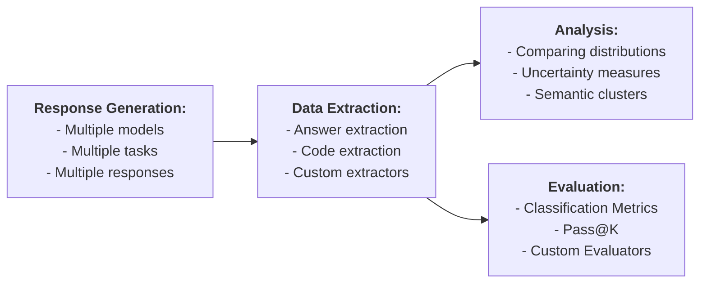

# llm-query

A utility for experimenting with LLMs for UNIX hackers. It supports the following workflow:

## Installation

Set some of the following API keys as environment variables, depending on the services you plan to use:

- `DASHSCOPE_API_KEY`
- `DEEPSEEK_API_KEY`
- `CLOSEAI_API_KEY`

Install the tool by running the command `python -m pip install .`

## Basic Usage

Run the following command to ask a question directly:

    llm-query "What is the capital of China?"

You can input a query stored in a file, such as `prompt.md`:

    llm-query < prompt.md

Write the response to a file (e.g., `output.md`):

    llm-query "What is the capital of China?" > output.md

For convenience, default settings such as the model and its temperature can be set globally using the option `-s/--setup`. These settings are saved in `~/.llm_query.yaml`:

    llm-query -s

Command-line options take precedence over the default settings.

## Batch Processing

To query two models (`qwen2.5-7b-instruct` and `qwen2.5-coder-7b-instruct`) with a temperature of 0.5, generate 10 responses, and save the results into the directory `output`, use the command:

    llm-query "What is the capital of China?" -m qwen2.5-7b-instruct qwen2.5-coder-7b-instruct -t 0.5 -n 10 -o output

The responses will be organized as follows (`__unnamed__` is the task id, `__unnamed__.md` is the prompt, `0.md`, ..., `9.md` are responses):

    output
    ├── qwen2.5-7b-instruct_1.0
    │   ├── __unnamed__.md
    │   └── __unnamed__
    │       ├── 0.md
    │       ...
    │       └── 9.md
    └── qwen2.5-coder-7b-instruct_1.0
        ├── __unnamed__.md
        └── __unnamed__
            ├── 0.md
            ...
            └── 9.md

To query a model with prompts contained in all files matching `*.md` in the current directory, use the command:

    llm-query -i *.md -o output

When a query is supplied through stdin or as a command-line argument, the task is automatically assigned the identifier `__unnamed__`. However, if the query originates from a file, the task will adopt the file's name (excluding the extension) as its identifier. In cases where multiple files are provided, ensure that their names are unique to avoid conflicts.

An output directory must be explicitly provided (e.g. `-o output`) when querying multiple models/responses/input files.

## Data Extraction

Extractors are shell commands used to extract specific data from responses. These commands are defined using a shell template language (described below). The special extractor `__ID__` simply returns the entire response without modification.

This is to extract text within the tag `<answer> ... </answer>` from all responses in `output`, and save the results into the directory `data`:

    llm-query -x output -o data --extractor "sed -n '0,/<\/answer>/s/.*<answer>\(.*\)<\/answer>.*/\1/p' %%ESCAPED_OUTPUT_FILE%%"

The above extractor searches for text wrapped within `<answer>` and `</answer>` tags and prints only the content inside the tags.

A response is treated as not containing any answer iff these two condition hold: (1) the extractor terminates with a non-zero exit code, and (2) its stdout is empty. In this case, the response is ignored.

The extracted data is saved into "txt" files. The file extension can be specified using the `--extension` options, e.g. `--extension py` resulting in:

    data
    └── qwen2.5-7b-instruct_1.0
        ├── __unnamed__.md
        └── __unnamed__
            ├── 0.py
            ├── 1.py
            ...
            └── 9.py

### On-the-fly Extraction

Data can be extracted on-the-fly while querying LLMs. Assuming that the answer extactor is selected using the interface of `-s`, the following command will print only the name of the city (i.e., `Beijing`):

    llm-query "What is the capital of China? Wrap the final answer with <answer> </answer>"

There are built-in helper functions to simplify extracting answers or code when performed on-the-fly. These helpers automatically augment the prompt and apply the necessary extractors to extract the relevant parts of the response.

    llm-query "What is the capital of China?" --answer
    llm-query "Write a Python function f(n: int) -> int that computes the n-th Catalan number" --code
    
## Clustering

To group answers into equivalence classes based qwen2.5's judgement, use the following command:

    llm-query -c output -o classes --equivalence "llm-query -m qwen2.5-72b-instruct 'Are these two answers equivalent: \"%%OUTPUT1%%\" and \"%%OUTPUT2%%\"?' --predicate"

Clustering can be performed for a subset of responses:

    llm-query -c output/qwen2.5-7b-instruct_1.0/a/ -o classes --equivalence "$EQUIVALENCE"
    
The equivalence class identifiers will be added to end of output file names, after the underscore:

    classes
    └── qwen2.5-7b-instruct_1.0
        ├── __unnamed__.md
        └── __unnamed__
            ├── 0_0.md
            ├── 1_0.md
            ...
            └── 9_3.md

This equivalence is defined via a shell command that exits with the zero status code when two answers are equivalent. The classes are computed using the [disjoint-set algorithm](https://en.wikipedia.org/wiki/Disjoint-set_data_structure).

Equivalence relations can be composed by repeated clustering:

    llm-query -c output -o classes1 --equivalence "$EQUIVALENCE1"
    llm-query -c classes1 -o classes2 --equivalence "$EQUIVALENCE2"
    
The equivalence relation can be configured:

- Using the `-s` option to select a predefined equivalence command.
- Or, specifying a custom equivalence command using the `--equivalence` option.

Clustering can also be performed on-the-fly while querying models if any non-trivial equivalence relations is specified. The trivial relation `__ID__` means syntactic identity and effectively disables clustering.

## Response Analysis

To analyze the distribution of equivalence classes of responses (across one or more models and/or inputs), use the following command:

    llm-query -d output/

A distribution can be computed for a subset of responses:

    llm-query -d output/a.md/qwen2.5-7b-instruct_1.0
    
This will compute and visualise

- [empirical probability](https://en.wikipedia.org/wiki/Empirical_probability) of samples;
- semantic uncertainty (semantic entropy) computed over the equivalence classes

Related work on semantic uncertainty:

- Semantic Uncertainty: Linguistic Invariances for Uncertainty Estimation in Natural Language Generation 
  Lorenz Kuhn, Yarin Gal, Sebastian Farquhar 
  ICLR 2023

Note that `-d` does not itself perform any data extraction or clustering.

### Comparing Distributions

To analyse difference between distributions of clusters, e.g. for different model temperatures, use the following command:

    llm-query --diff output/qwen2.5-7b-instruct_1.0/a output/qwen2.5-7b-instruct_0.5/a
    
The difference is analysed wrt to semantic clusters, thus when using `--diff` on claustered data, the appropriate equivalence relation has to be specified.

This will compute and visualise:

- [Wasserstein metric](https://en.wikipedia.org/wiki/Wasserstein_metric)
- [Permutation test](https://en.wikipedia.org/wiki/Permutation_test) based on the Wasserstein metric
- [Jaccard index](https://en.wikipedia.org/wiki/Jaccard_index) over supports
- Differences between supports

## Evaluation

The evaluation mode is enabled with the `-e` option and evaluates previously computed responses against specified criteria.

To evaluate the responses stored in the output directory by checking if they are equal to a specific value, i.e. `Beijing`, use:

    llm-query -e output --equal Beijing

Evalation can be done for a subset of responses:

    llm-query -e output/a.md/qwen2.5-7b-instruct_1.0 --equal Beijing
    
The evaluator `--equal VALUE` checks if the answer is equivalent to `VALUE` wrt the equivalence relations specified with `--equivalence` or the default one selected with `-s`.

You can specify a custom evaluator using the `--evaluator` option. A custom evaluator is a shell command that terminates with the zero exit code if the response passes evaluation.

    llm-query -e output --evaluator 'wc -w <<< %%ESCAPED_OUTPUT%% | grep -q ^1$'

This example evaluates whether each response contains exactly one word.

It will compute the following:
- Evaluation table
- Pass@1

Related work on Pass@1:

- Evaluating Large Language Models Trained on Code 
  Chen et al. 
  https://arxiv.org/abs/2107.03374

### Classification Metrics

When performing binary classification with the labels "Yes" and "No" (case-insensitive), the following command computes classification metrics:

    llm-query -e output --classification ground_truth.csv
    
where `ground_truth.csv` contains two columns: task ids and ground truth labels.

It will compute the following:

- [Confusion matrix](https://en.wikipedia.org/wiki/Confusion_matrix)
- [Precision and recall](https://en.wikipedia.org/wiki/Precision_and_recall)
- [F-score](https://en.wikipedia.org/wiki/F-score)
- [Matthews correlation coefficient (MCC)](https://en.wikipedia.org/wiki/Phi_coefficient)

### On-the-fly Evaluation

When a single response is queried from an single model, it can be evaluated on-the-fly.

    llm-query "What is the capital of China?" --answer --equal Beijing
    
This helper option acts as a predicate over `$CITY`:

    llm-query "Is $CITY the capital of China?" --predicate

It is equivalent to the following (plus, the command will terminate with the zero exit code iff it passes the evaluation):

    llm-query "Is $CITY the capital of China? Respond Yes or No." --answer --equal Yes >/dev/null

## Shell Template Language

The shell template language allows dynamic substitution of specific placeholders with runtime values before executing a shell command. These placeholders are instantiated and replaced with their corresponding values before the command is executed by the system shell.

Available placeholders:

- `%%OUTPUT%%` - replaced with the raw output (response or extracted data).
- `%%OUTPUT_FILE%%` - replaced with a path to a temporary file containing the output.
- `%%PROMPT%%` - replaced with the raw input prompt.
- `%%PROMPT_FILE%%` - replaced with a path to a temporary file containing the input prompt.
- `%%TASK_ID%%` - replaced with the task id.

For commands that require multiple outputs, indexed placeholders are provided, e.g. `%%OUTPUT1%%`, `%%OUTPUT2%%`.

Variants of shell-escaped placeholders are available for safety when handling special characters, e.g. `%%ESCAPED_OUTPUT%%`.

## Troubleshooting

The `--debug` option prints detailed logs on stderr.
