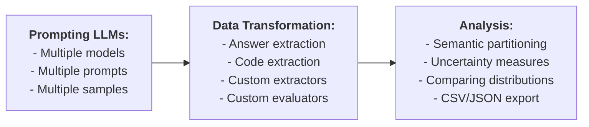

# llm-play

A tool that queries LLMs and executes experimental pipelines.

## Installation

Set some of the following API keys as environment variables, depending on the services you plan to use:

- `DASHSCOPE_API_KEY`
- `DEEPSEEK_API_KEY`
- `CLOSEAI_API_KEY`

Install the tool by running the command `python -m pip install .`

## Basic Usage

An LLM can be queried via an argument, a specified prompt file, or stdin:

    llm-play "What is the capital of China?"
    llm-play --prompt prompt.md
    llm-play < prompt.md
    
The argument and the file options are mutually-exclusive. They both take precedence over stdin.

In this case, the response is printed on stdout, and can be redirected to a file:

    llm-play "What is the capital of China?" > output.md

For convenience, default settings such as the model and its temperature can be configured interactively with `-c/--configure`. These settings are saved in `~/.llm_play.yaml`:

    llm-play -c

Command-line options take precedence over the default settings.

## Batch Processing

To query two models (`qwen2.5-7b-instruct` and `qwen2.5-coder-7b-instruct`) with a temperature of 0.5, sample 10 responses, and save the results into the directory `samples`, use the command:

    llm-play --prompt prompts/question1.md \
             --model qwen2.5-7b-instruct qwen2.5-coder-7b-instruct \
             -t 0.5 \
             -n 10 \
             --output samples
             
The samples will be stored in a filesystem tree as follows:

    samples
    ├── qwen2.5-7b-instruct_0.5
    │   ├── question1_2f73f5f.md
    │   └── question1_2f73f5f
    │       ├── 0_0.md
    │       ...
    │       └── 9_4.md
    └── qwen2.5-coder-7b-instruct_0.5
        ├── question1_2f73f5f.md
        └── question1_2f73f5f
            ├── 0_0.md
            ...
            └── 9_7.md
            
In this tree, `question1` is the prompt label, `2f73f5f` is its truncated SHA1 hash, `question1_2f73f5f.md` contains the prompt. Prompts with repeating hashes are skipped. `0_0.md`, ..., `9_4.md` are the samples. In `5_3.md`, `5` is the sample identifier, and `3` is the identifier of its equivalence class. Please see [Partitioning](#partitioning) for details.
            
The data can also be stored in CSV and JSON formats. Please see [Data Formats](#data-formats) for details.

To query a model with prompts contained in all files matching `*.md` in the current directory, use the command:

    llm-play --prompt *.md --output samples
    
If the query originates from a file, the prompt will adopt the file's name (excluding the extension) as its label. When a query is supplied through stdin or as a command-line argument, the label is empty.
    
To update an existing store, the `--update` option should be used instead of `--output`:
    
    llm-play --prompt *.md --update samples

In case of collisions, i.e. samples for the same (model, temperature, prompt) tuple already exist in the store, the prompt files with matching hashes will be updated, and the old responses are removed.

## Data Transformation

Data transformation can be used, for example, to extract relevant information from the generated samples or from data extracted in earlier stages. Transformation is performed by shell commands defined using the [shell template language](#shell-template-language). The special function `__ID__` simply returns the entire string without modification.

This is to extract text within the tag `<answer> ... </answer>` from all samples in `samples`, and save the results into the directory `extracted`:

    llm-play --map samples \
             --function "sed -n '0,/<\/answer>/s/.*<answer>\(.*\)<\/answer>.*/\1/p' %%ESCAPED_DATA_FILE%%" \
             --output extracted

The above function searches for text wrapped within `<answer>` and `</answer>` tags and prints only the content inside the tags.

A transformation of a datum fails, e.g. if it does not contain any relevant information to extract, iff the function terminates with a non-zero exit code.

By default, the extracted data is saved into "txt" files. The file extension can be specified using the `--extension` options, e.g. `--extension py` resulting in:

    extracted
    └── qwen2.5-7b-instruct_1.0
        ├── _2f73f5f.md
        └── _2f73f5f
            ├── 0_0.py
            ├── 1_1.py
            ...
            └── 9_9.py

### On-the-fly Transformation

Data can be extracted on-the-fly while querying LLMs if `--function` is explicitly provided:

    llm-play "What is the capital of China? Wrap the final answer with <answer> </answer>" \
             --function "sed -n '0,/<\/answer>/s/.*<answer>\(.*\)<\/answer>.*/\1/p' %%ESCAPED_DATA_FILE%%"

There are built-in convenience functions to simplify extracting answers or code. The option `--answer` automatically augment the prompt and apply the necessary transformation to extract the relevant parts of the response:

    llm-play "What is the capital of China?" --answer
    
The option `--code` extracts a code block from Markdown formatting.
    
    llm-play "Write a Python function f(n: int) -> int that computes the n-th Catalan number" --code

## Partitioning

By default, all responses are partitioned into equivalence classes based their syntactic identity using the relation `__ID__`.

To group answers into equivalence classes based qwen2.5's judgement, use the following command:

    llm-play --partition data \
             --equivalence "llm-play --model qwen2.5-72b-instruct 'Are these two answers equivalent: \"%%CONDENSED_DATA1%%\" and \"%%CONDENSED_DATA2%%\"?' --predicate" \ 
             --output classes
             
Paritioning can be performed for a subset of data:

    llm-play --partition data/qwen2.5-7b-instruct_1.0/a/ \
             --equivalence "$EQUIVALENCE" \
             --output classes
    
When using the filesystem tree format, the equivalence class identifiers will be added to the end of output file names, after the underscore:

    classes
    └── qwen2.5-7b-instruct_1.0
        ├── _69a3a31.md
        └── _69a3a31
            ├── 0_0.md
            ├── 1_0.md
            ...
            └── 9_3.md
            
The class identifiers across multiple directories are not consistent.

This equivalence is defined via a shell command that exits with the zero status code when two answers are equivalent. The classes are computed using the [disjoint-set algorithm](https://en.wikipedia.org/wiki/Disjoint-set_data_structure).

Equivalence relations can be composed by repeated partitioning:

    llm-play --partition data --equivalence "$EQUIVALENCE1" --output classes1
    llm-play --partition classes1 --equivalence "$EQUIVALENCE2" --output classes2
    
The equivalence relation can be configured:

- Using the `-c` option to select a predefined equivalence command.
- Or, specifying a custom equivalence command using the `--equivalence` option.

Paritioning can also be performed on-the-fly while querying models if any non-trivial equivalence relations is specified explicitly with `--equivalence`.

## Data Analysis

To show the distribution of equivalence classes of outputs (across one or more models and/or prompts), use the following command:

    llm-play --distribution data

A distribution can be analyzed for a subset of data:

    llm-play --distribution data/qwen2.5-7b-instruct_1.0/a_2f73f5f
    
This will compute and visualise

- [empirical probability](https://en.wikipedia.org/wiki/Empirical_probability) of equivalence classes;
- semantic uncertainty (semantic entropy) computed over the equivalence classes

Related work on semantic uncertainty:

- Semantic Uncertainty: Linguistic Invariances for Uncertainty Estimation in Natural Language Generation 
  Lorenz Kuhn, Yarin Gal, Sebastian Farquhar 
  ICLR 2023

The distribution can be exported with `--output` into either CSV or JSON formats (not a filesystem tree).
    
Note that `--distribution` does not itself perform any data extraction or partitioning.

### Comparing Distributions

To analyse difference between distributions of equivalence classes, e.g. for different model temperatures, use the following command:

    llm-play --diff data/qwen2.5-7b-instruct_1.0/a_2f73f5f data/qwen2.5-7b-instruct_0.5/a_2f73f5f
    
This command aligns the class labels between these two distributions w.r.t. the specified equivalence relation, as well as computes some useful statistics:

- [Wasserstein metric](https://en.wikipedia.org/wiki/Wasserstein_metric)
- [Permutation test](https://en.wikipedia.org/wiki/Permutation_test) based on the Wasserstein metric
- [Jaccard index](https://en.wikipedia.org/wiki/Jaccard_index) over supports
- Differences between supports

The difference can be exported with `--output` into either CSV or JSON formats (not a filesystem tree).

## Evaluation

The samples or extracted data can be evaluated using function. This example evaluates whether each datum contains exactly one word:

    llm-play --map data --function 'wc -w <<< %%ESCAPED_DATA%% | grep -q ^1$ && echo Yes || echo No'

Special evaluation function are provided for convenience. To evaluate data by checking if each datum is equal to a specific value, i.e. `Beijing`, use:

    llm-play --map data --equal Beijing
    
The evaluator `--equal VALUE` checks if the answer is equivalent to `VALUE` wrt the equivalence relations specified with `--equivalence` or the default one selected with `-c`. It will return either `Yes` or `No`.

Evalation can be done for a subset of outputs:

    llm-play --map data/qwen2.5-7b-instruct_1.0/a_2f73f5f --equal Beijing
    
### Predicates

Predicates are special one-the-fly query evaluators. For example, this command acts as a predicate over `$CITY`:

    llm-play "Is $CITY the capital of China?" --predicate

It is equivalent to the following:

    llm-play "Is $CITY the capital of China? Respond Yes or No." \
              --answer \
              --equal Yes \
              --equivalence __TRIMMED_CASE_INSENSITIVE__ \
              --quiet
              
Additionally, the predicate will terminate with the zero exit code iff it passes the evaluation. Predicates can only be applied to interactive commands with a single model/task/response, and without a specified output.

## Data Formats

The supported data formats are

- Filesystem tree (FS-tree) designed for human readability
- JSON files designed for easy storage and sharing
- CSV files for evaluation

The argument of `--output` is treated as a directory path unless it ends with `.json` or `.csv`.

FS-tree and JSON formats are interchangeble. They both can be used as outputs of LLM sampling, and as inputs or outputs of the `--map` and `--partition` commands. Only FS-tree and JSON can be updated with `--update`.

CSV format is used as the only supported output format for `--diff`, `--distrubiton`, and as an alternative output format for `--map` and `--partition`. The CSV encoding is lossy: the data cannot be loaded back from a CSV file, as it does not save prompts, and truncate data longer than 30 characters. If at least one datum is truncated, the corresponding column name is changed from `Content` to `Content [Truncated]`. Different commands produce different CSV schemas.

The identity function can be used to convert data between different formats, e.g.

    llm-play --map data --function __ID__ --output data.json
    llm-play --map data.json --function __ID__ --output data.csv
    
## Shell Template Language

The shell template language allows dynamic substitution of specific placeholders with runtime values before executing a shell command. These placeholders are instantiated and replaced with their corresponding values before the command is executed by the system shell.

Available placeholders for data:

- `%%CONDENSED_ESCAPED_DATA%%` - the single-lined, stripped, truncated to 100 characters and shell-escaped text.
- `%%ESCAPED_DATA%%` - the shell-escaped text.
- `%%CONDENCED_DATA%%` - the single-lined, stripped, truncated to 100 characters text.
- `%%RAW_DATA%%` - the original text.

Similarly, `RAW_`, `ESCAPED_`, `CONDENCED_` and `CONDENSED_ESCAPED_` variants are provided for the following variables:

- `%%PROMPT%%` - the prompt content.

The `ESCAPED_` variants are provided for the following variables:

- `%%DATA_FILE%%` - a path to a temporary file containing the data.
- `%%PROMPT_FILE%%` - a path to a temporary file containing the prompt.
- `%%PROMPT_LABEL%%` - the prompt label.

For equivalence relation commands, which require multiple arguments, the data and prompt placeholders are indexed, e.g. `%%RAW_DATA1%%` and `%%PROMPT2_LABEL%%`.

## Troubleshooting

The `--debug` option prints detailed logs on stderr.
