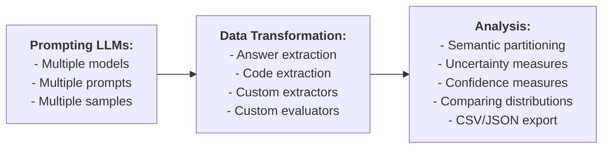

# llm-play

llm-play is a tool that queries LLMs, analyzes responses, and executes experimental pipelines.

## Installation

Set some of the following API keys as environment variables, depending on the services you plan to use:

- `DASHSCOPE_API_KEY`
- `DEEPSEEK_API_KEY`
- `CLOSEAI_API_KEY`

Install the tool by running the command `python -m pip install .`

## Basic Usage

An LLM can be queried via an argument, a specified prompt file, or stdin:

    llm-play "What is the capital of China?"
    llm-play --prompt prompt.md
    llm-play < prompt.md

The argument and the file options are mutually-exclusive. They both take precedence over stdin.

In this case, the response is printed on stdout, and can be redirected to a file:

    llm-play "What is the capital of China?" > output.md

For convenience, default settings such as the model and its temperature can be configured interactively with `-c/--configure`. These settings are saved in `~/.llm_play.yaml`:

    llm-play -c

Command-line options take precedence over the default settings.

## Batch Processing

When either the number of models or prompts or responses is greater than one, the tool operates in batch mode. For example, to sample 10 responses from two models (`qwen2.5-7b-instruct` and `qwen2.5-coder-7b-instruct`) with a temperature of 0.5, and save the results into the directory `samples`, use the command:

    llm-play --prompt prompts/question1.md \
             --model qwen2.5-72b-instruct qwen2.5-7b-instruct \
             -t 0.5 \
             -n 10

In batch mode, a short summary of responses will be printed on stdout:

    Model                │ Temp. │ Label     │ Hash       │ Sample │ Class │ Content
    ─────────────────────┼───────┼───────────┼────────────┼────────┼───────┼────────
    qwen2.5-72b-instruct │   0.5 │ question1 │ 4ae91f5... │      0 │     0 │ "It ...
    qwen2.5-72b-instruct │   0.5 │ question1 │ 4ae91f5... │      1 │     1 │ "It ...
    qwen2.5-72b-instruct │   0.5 │ question1 │ 4ae91f5... │      2 │     2 │ "It ...
    qwen2.5-72b-instruct │   0.5 │ question1 │ 4ae91f5... │      3 │     3 │ "It ...
    qwen2.5-72b-instruct │   0.5 │ question1 │ 4ae91f5... │      4 │     4 │ "It ...
    qwen2.5-72b-instruct │   0.5 │ question1 │ 4ae91f5... │      5 │     5 │ "It ...
    ...

In this table, `question1` is the prompt label, `4ae91f5bd6090fb6` is its SHAKE128 length=8 hash. Prompts with repeating hashes are skipped.  The `Class` column displays the IDs of equivalence classes of responses. Please see [Partitioning](#partitioning) for details.

To save full results, the output store needs to be specified with the option `--output`. For example, adding `--output samples` will save the results in the following filesystem tree:

    samples
    ├── qwen2.5-7b-instruct_0.5
    │   ├── question1_4ae91f5bd6090fb6.md
    │   └── question1_4ae91f5bd6090fb6
    │       ├── 0_0.md
    │       ...
    │       └── 9_9.md
    └── qwen2.5-coder-7b-instruct_0.5
        ├── question1_4ae91f5bd6090fb6.md
        └── question1_4ae91f5bd6090fb6
            ├── 0_0.md
            ...
            └── 9_9.md

In this tree, `question1_4ae91f5bd6090fb6.md` contains the prompt; `0_0.md`, ..., `9_9.md` are the samples. In `5_3.md`, `5` is the sample identifier, and `3` is the identifier of its equivalence class.

The data can also be stored in CSV and JSON formats. Please see [Data Formats](#data-formats) for details.

Multiple prompt files can be specified as inputs, e.g. using all `*.md` files in the current directory:

    llm-play --prompt *.md --output samples

When the argument of `--prompt` is a directory, all `*.md` files are loaded from this directory non-recursively.

If the query originates from a file, the prompt will adopt the file's name (excluding the extension) as its label. When a query is supplied through stdin or as a command-line argument, the label is empty.

To update an existing store, the `--update` option should be used instead of `--output`:

    llm-play --prompt *.md --update samples

In case of collisions, i.e. samples for the same (model, temperature, prompt) tuple already exist in the store, the prompt labels with matching hashes will be updated, and the old responses are removed.

## Data Transformation

Data transformation can be used, for example, to extract relevant information from the generated samples or from data extracted in earlier stages. This is to extract text within the tag `<answer> ... </answer>` from all samples in `samples`, and save the results into the directory `extracted`:

    llm-play --map samples \
             --function __FIRST_TAGGED_ANSWER__ \
             --output extracted

The above function searches for text wrapped within `<answer>` and `</answer>` tags and prints only the content inside the tags.

By default, the extracted data is saved into "txt" files. The file extension can be specified using the `--extension` options, e.g. `--extension py` resulting in:

    extracted
    └── qwen2.5-7b-instruct_1.0
        ├── _4ae91f5bd6090fb6.md
        └── _4ae91f5bd6090fb6
            ├── 0_0.py
            ├── 1_1.py
            ...
            └── 9_9.py

### Functions

Transformation is performed by either by builtin functions or shell commands. The builtin function `__ID__` simply returns the entire string without modification. The builtin function `__FIRST_TAGGED_ANSWER__` returns the string wrapped into the first occurence of the tag `<answer></answer>`. The builtin function `__FIRST_MARKDOWN_CODE_BLOCK__` extract the content of the first markdown block.

Function defined through shell commands should use the [shell template language](#shell-template-language). For example, this is equivalent to `__FIRST_TAGGED_ANSWER__` for single-line answers:

    --function "sed -n '0,/<\/answer>/s/.*<answer>\(.*\)<\/answer>.*/\1/p' %%ESCAPED_DATA_FILE%%"

A transformation of a datum fails iff the function terminates with a non-zero exit code; in this case, the datum is ignored. Thus, shell commands can also be used for data filtering. e.g. filtering out responses not containing useful information.

Answers can also be extracted by LLMs. For example, this function checks if a prevously received response is affirmative:

    --function "llm-play --model qwen2.5-7b-instruct '<answer>'%%CONDENSED_ESCAPED_DATA%%'</answer>. Is this answer affirmative? Respond Yes or No.' --answer"

### On-the-fly Transformation

Data can be extracted on-the-fly while querying LLMs if `--function` is explicitly provided (not via `-c`):

    llm-play "What is the capital of China? Wrap the final answer with <answer> </answer>" \
             --function __FIRST_TAGGED_ANSWER__

There are convenience options to simplify extracting answers or code. The option `--answer` automatically augment the prompt and apply the necessary transformation to extract the relevant parts of the response:

    llm-play "${QUESTION}" --answer

is equivalent to

    llm-play "${QUESTION} Wrap the final answer with <answer></answer>."" --function __FIRST_TAGGED_ANSWER__

The option `--code` extracts a code block from Markdown formatting.

    llm-play "Write a Python function that computes the n-th Catalan number" --code

is equivalent to

    llm-play "Write a Python function that computes the n-th Catalan number" --function __FIRST_MARKDOWN_CODE_BLOCK__

## Partitioning

By default, all responses are grouped into equivalence classes based on their syntactic identity. To ensures that responses are categorized without regard to trailing whitespace or differences in uppercase and lowercase characters, use the following command:

    llm-play --partition responses \
             --relation __TRIMMED_CASE_INSENSITIVE__ \
             --output classes

Paritioning can be performed for a subset of data:

    llm-play --partition data/qwen2.5-7b-instruct_1.0/a_4ae91f5bd6090fb6 \
             --relation "$EQUIVALENCE" \
             --output classes

When using the filesystem tree format, the equivalence class identifiers will be added to the end of output file names, after the underscore:

    classes
    └── qwen2.5-7b-instruct_1.0
        ├── _4ae91f5bd6090fb6.md
        └── _4ae91f5bd6090fb6
            ├── 0_0.md
            ├── 1_0.md
            ...
            └── 9_3.md

The class identifiers are consistent only within samples for a single (model, prompt) pair. The classes are computed using [disjoint-set](https://en.wikipedia.org/wiki/Disjoint-set_data_structure).

Equivalence relations can be composed by repeated partitioning:

    llm-play --partition data --relation "$EQUIVALENCE1" --output classes1
    llm-play --partition classes1 --relation "$EQUIVALENCE2" --output classes2

An equivalence is defined via a builtin function or a shell command. The builtin relation `__ID__` checks if two answers are syntactically identical. The builtin relation `__TRIMMED_CASE_INSENSITIVE__` weakens the criteria by ignoring trailing whitespaces and is not case sensitive.

A relation defined via a shell command holds iff the command exits with the zero status code. For example, this is to group answers into equivalence classes based `qwen2.5-7b-instruct`'s judgement:

    --relation "llm-play --model qwen2.5-7b-instruct 'Are these two answers equivalent: <answer1>'%%CONDENSED_ESCAPED_DATA1%%'</answer1> and <naswer2>'%%CONDENSED_ESCAPED_DATA2%%'</answer2>?' --predicate"

The equivalence relation can be configured using the `-c` option to select a predefined equivalence command when using the options `--diff`, `--equal` or `--partition`. Paritioning can also be performed on-the-fly while sampling responses if an equivalence relation is specified explicitly with `--relation`.

## Data Analysis

To show the distribution of equivalence classes of outputs (across one or more models and/or prompts), use the following command:

    llm-play --distribution data

A distribution can be analyzed for a subset of data, and exported into a CSV file:

    llm-play --distribution data/qwen2.5-7b-instruct_1.0/a_4ae91f5bd6090fb6
             --output distribution.csv

This will compute and visualise

- [empirical probability](https://en.wikipedia.org/wiki/Empirical_probability) of equivalence classes;
- semantic uncertainty (semantic entropy) computed over the equivalence classes

Related work on semantic uncertainty:

- Semantic Uncertainty: Linguistic Invariances for Uncertainty Estimation in Natural Language Generation 
  Lorenz Kuhn, Yarin Gal, Sebastian Farquhar 
  ICLR 2023

Note that `--distribution` does not itself perform any data extraction or partitioning.

### Comparing Distributions [WIP]

To analyse the difference between empirical distributions of equivalence classes, e.g. for different model temperatures, use the following command:

    llm-play --diff data/qwen2.5-7b-instruct_1.0/a_4ae91f5bd6090fb6 data/qwen2.5-7b-instruct_0.5/a_4ae91f5bd6090fb6

This command aligns the class labels between these two distributions w.r.t. the specified equivalence relation, as well as computes some useful statistics:

- [Wasserstein metric](https://en.wikipedia.org/wiki/Wasserstein_metric)
- [Permutation test](https://en.wikipedia.org/wiki/Permutation_test) based on the Wasserstein metric
- [Jaccard index](https://en.wikipedia.org/wiki/Jaccard_index) over supports
- Differences between supports

The difference can be exported with `--output` into CSV format.

### Confidence Measures [WIP]

Compute the following confidence measure:

- Average Token Probability
- Generated Sequence Probability
- Verbalized Self-Ask
- Question Answering Logit

Related work on LLM confidence:

- Calibration and correctness of language models for code 
  Claudio Spiess, David Gros, Kunal Suresh Pai, Michael Pradel, Md Rafiqul Islam Rabin, Amin Alipour, Susmit Jha, Prem Devanbu, Toufique Ahmed 
  ICSE 2025

## Evaluation

The samples or extracted data can be evaluated using function. This example evaluates whether each datum contains exactly one word:

    llm-play --map data --function 'wc -w <<< %%ESCAPED_DATA%% | grep -q ^1$ && echo Yes || echo No'

Special evaluation function are provided for convenience. To evaluate data by checking if each datum is equal to a specific value, i.e. `Beijing`, use:

    llm-play --map data --equal Beijing

The evaluator `--equal VALUE` checks if the answer is equivalent to `VALUE` wrt the equivalence relations specified with `--relation` or the default one selected with `-c`. It will return either `Yes` or `No`.

Evalation can be done for a subset of outputs:

    llm-play --map data/qwen2.5-7b-instruct_1.0/a_4ae91f5bd6090fb6 --equal Beijing

### Predicates

Predicates are special one-the-fly boolean evaluators. For example, this command acts as a predicate over `$CITY`:

    llm-play "Is $CITY the capital of China?" --predicate

It is equivalent to the following:

    if [ "$(llm-play "Is $CITY the capital of China? Respond Yes or No." \
                    --answer \
                    --equal Yes \
                    --relation __TRIMMED_CASE_INSENSITIVE__)" = "Yes" ]; then
        exit 0
    else
        exit 1
    fi

The predicate will terminate with the zero exit code iff it passes the evaluation; its output cannot be exported with `--output`. Predicates can only be applied to commands with a single model/prompt/response.

## Data Formats

The supported data formats are

- Filesystem tree (FS-tree) designed for human readability
- JSON files designed for easy storage and sharing
- CSV files for evaluation

The argument of `--output` is treated as a directory path unless it ends with `.json` or `.csv`.

FS-tree and JSON formats are interchangeble. They both can be used as outputs of LLM sampling, and as inputs or outputs of the `--map` and `--partition` commands. Only FS-tree and JSON can be updated with `--update`.

CSV format is used as the only supported output format for `--diff`, `--distrubiton`, and as an alternative output format for `--map` and `--partition`. The CSV encoding is lossy: the data cannot be loaded back from a CSV file, as it does not save prompts, and truncate data longer than 30 characters. If at least one datum is truncated, the corresponding column name is changed from `Content` to `Content [Truncated]`. Different commands produce different CSV schemas.

The identity function can be used to convert data between different formats, e.g.

    llm-play --map data --function __ID__ --output data.json
    llm-play --map data.json --function __ID__ --output data.csv

## Shell Template Language

The shell template language allows dynamic substitution of specific placeholders with runtime values before executing a shell command. These placeholders are instantiated and replaced with their corresponding values before the command is executed by the system shell.

Available placeholders for data:

- `%%CONDENSED_ESCAPED_DATA%%` - the single-lined, stripped, truncated to 100 characters and shell-escaped text.
- `%%ESCAPED_DATA%%` - the shell-escaped text.
- `%%CONDENCED_DATA%%` - the single-lined, stripped, truncated to 100 characters text.
- `%%RAW_DATA%%` - the original text.

Similarly, `RAW_`, `ESCAPED_`, `CONDENCED_` and `CONDENSED_ESCAPED_` variants are provided for the following variables:

- `%%PROMPT%%` - the prompt content.

The `ESCAPED_` variants are provided for the following variables:

- `%%DATA_FILE%%` - a path to a temporary file containing the data.
- `%%PROMPT_FILE%%` - a path to a temporary file containing the prompt.
- `%%PROMPT_LABEL%%` - the prompt label.

For equivalence relation commands, which require multiple arguments, the data and prompt placeholders are indexed, e.g. `%%RAW_DATA1%%` and `%%PROMPT2_LABEL%%`.

## Other Options

The option `--debug` prints detailed logs on stderr.

The option `--quiet` disables all stdout output.
